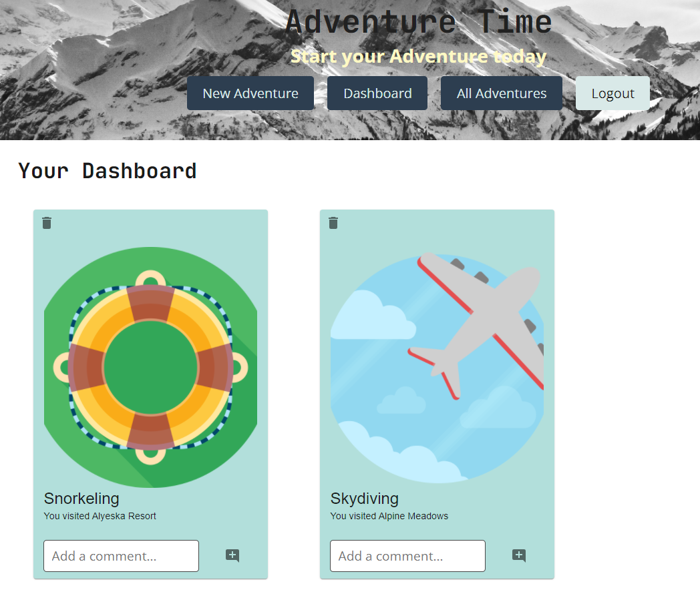
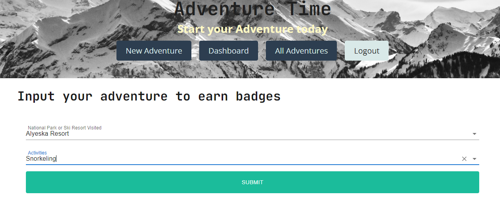
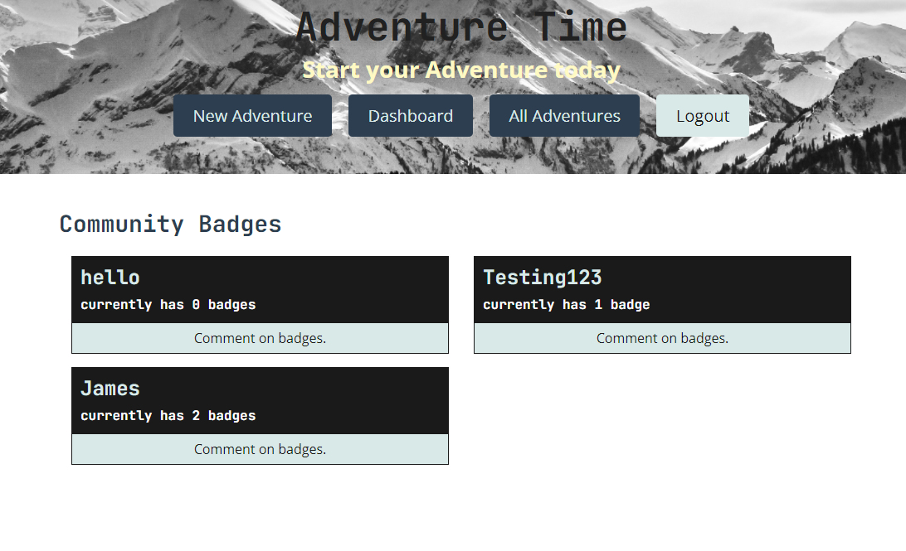

# Adventure Time

  
#### Table of Contents
* [Project Description](#project-description)
* [Contributors](#contributors)
* [Installation Instructions](#installation-instructions)
* [Usage Information](#usage-information)
* [Contributor Guidelines](#contributor-guidelines)
* [Code of Conduct](#code-of-conduct)
* [Test Instructions](#test-instructions)
* [License](#license)
* [App Link](#app-link)
* [Questions](#questions)
* [Deployment Image](#deployment-image)

## Project Description
* The time has come to go out and explore all of the beautiful open spaces this country has to offer. When using Adventure Time you can earn badges by visiting outdoor spaces and comment on friends adventure. 

## Contributors
* Kevin Devlin
* Landon Waddell
* Vanessa Bonilha
* James Odell

## Installation Instructions
* react
* graphql
* mongoose
* apollo
* express
* axios
* bcrypt
* jwt-decode
* concurrently
* bootstrap
* material ui

## Usage Information
* You need to install the packages above to be able to run this code.

## Contributor Guidelines
* Contribution rules are under the Code of Conduct section

## Code of Conduct
* [Contributor Code of Conduct](https://www.contributor-covenant.org/version/2/0/code_of_conduct/code_of_conduct.md)

## Test Instructions
* No test required

## License
* MIT License

## App Link
* [Adventure Time](https://adventure-time-with-friends.herokuapp.com/)

## Questions
* For additional help or questions about collaboration, please reach out to kevindevlin11@gmail.com
* Follow us on Github at 
* [azwethinkweizkd](https://github.com/azwethinkweizkd)
* [bonilhav](https://github.com/bonilhav)
* [Landon0615](https://github.com/Landon0615)
* [JamesO1231](http://github.com/JamesO1231)

## Deployment Image

